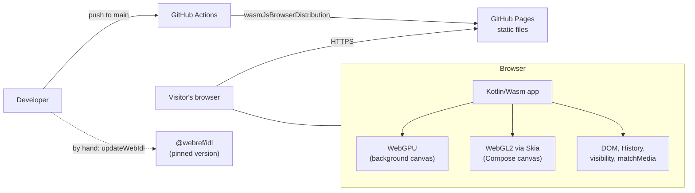
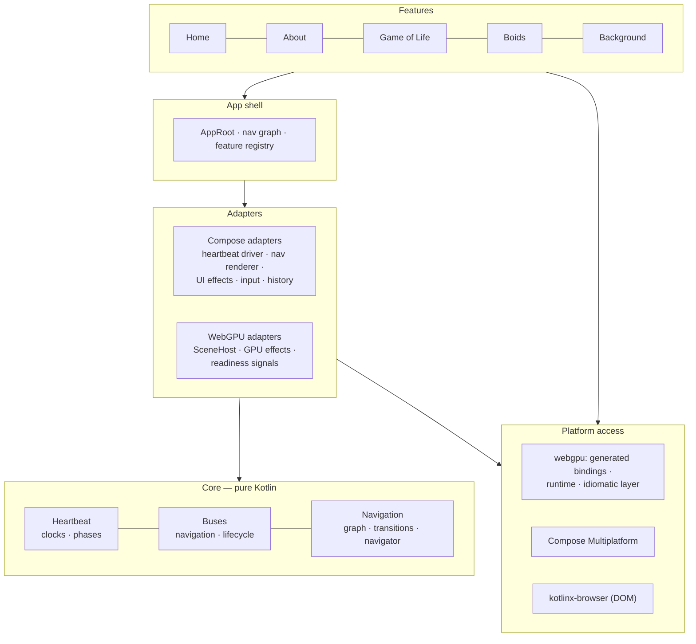
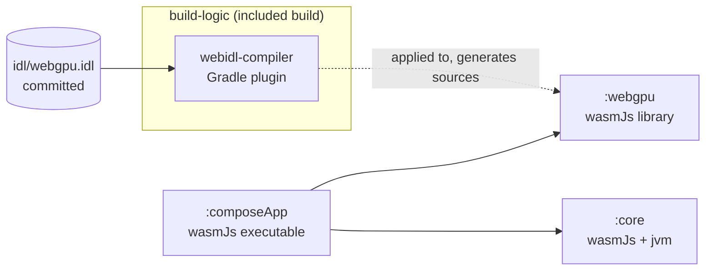
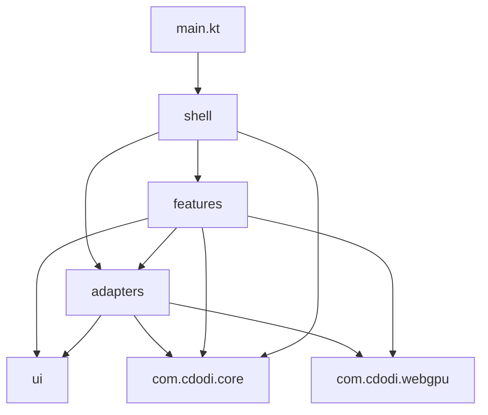
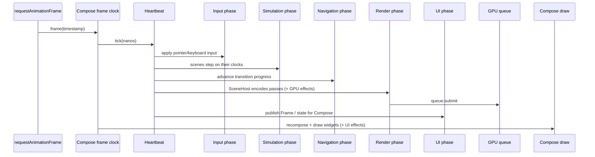
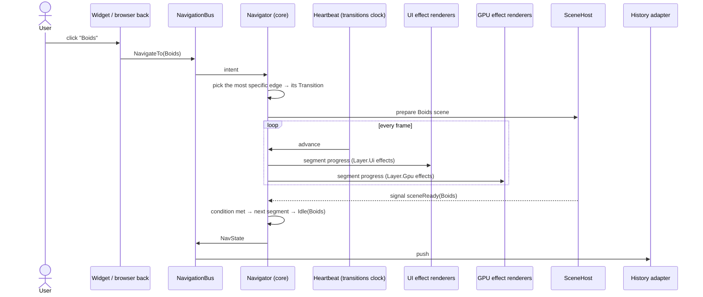
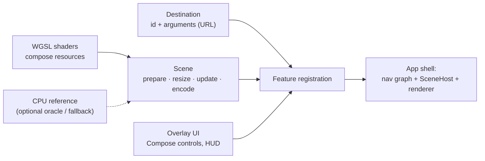
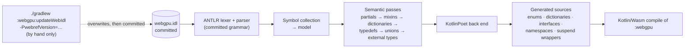

# Architecture

_High-level architecture of the site after the move to WebGPU. This describes the target structure and how the parts fit together; the step-by-step path to get there is in `PLAN.md`._

## 1. Principles

1. **Two layers of rendering.** WebGPU draws everything graphical, on a background canvas. Compose draws the interactive UI, on a transparent canvas on top.
2. **One clock.** The heartbeat is the single source of truth for time. Every animation, simulation and transition takes its time from it.
3. **The core knows no framework.** Time, buses and navigation are pure Kotlin. Compose and WebGPU are plugged in through adapters.
4. **Dependencies point inward.** Features depend on adapters and the core; the core depends on nothing.
5. **Describe, then render.** The core describes *what* should happen (a transition with effects on a layer); the adapters decide *how* it's drawn.
6. **Generated, type-safe platform access.** WebGPU is used through bindings generated by our own WebIDL compiler, from a committed and pinned spec.
7. **Degrade gracefully.** No WebGPU, a lost GPU device or reduced-motion settings all lead to a working site, not a blank page.

## 2. System context



The site is fully static: no backend. The only network step outside the visitor's page load is the manual IDL update, which a developer runs by hand; the normal build doesn't touch the network.

## 3. Layers



| Layer | Owns | May depend on | Must not depend on |
|---|---|---|---|
| **Core** | Time, buses, navigation model | Kotlin stdlib, kotlinx-coroutines | Compose, WebGPU, DOM |
| **Platform access** | Type-safe WebGPU API, resource ownership | Kotlin/Wasm interop, kotlinx-browser | Core, features |
| **Adapters** | Turning core descriptions into pixels and events | Core, platform access | Features |
| **App shell** | Wiring: graph definition, registries, startup, fallback | Everything below | — |
| **Features** | A page: its destination, scene, UI and shaders | Core, adapters, platform access | Other features |

## 4. Program structure

### 4.1 Repository layout

```
maximums.github.io/
├── build-logic/                    included build: everything that runs at build time
│   ├── settings.gradle.kts
│   ├── conventions/                convention plugins shared by the modules
│   │                               (cdodi.kmp-wasm-library, cdodi.testing)
│   └── webidl-compiler/            the WebIDL → Kotlin compiler (Gradle plugin)
├── core/                           :core — heartbeat, buses, navigation (pure Kotlin)
├── webgpu/                         :webgpu — generated bindings + runtime + idiomatic layer
│   └── idl/webgpu.idl              committed, pinned @webref/idl version
├── composeApp/                     :composeApp — the site
├── gradle/libs.versions.toml       single source of versions
├── .github/workflows/              CI + Pages deploy
└── README.md · ARCHITECTURE.md · DESIGN.md · PLAN.md · REVIEW.md
```

The base package stays `com.cdodi`. Each module gets its own sub-namespace (`com.cdodi.core`, `com.cdodi.webgpu`, `com.cdodi.webidl`), so a type's module is visible from its package name.

### 4.2 Module graph



- **`build-logic/webidl-compiler`**: the WebIDL → Kotlin compiler, packaged as a Gradle plugin, with its own tests (fixtures, golden files, TestKit).
- **`:core`**: heartbeat, buses, navigation. The jvm target exists only so tests run fast without a browser.
- **`:webgpu`**: generated bindings, the small runtime (`await` that keeps JS errors, object builders, staging typed arrays) and the hand-written idiomatic layer (`GpuContext`, resource scopes, shader diagnostics).
- **`:composeApp`**: the site. Adapters, app shell and features live here, organised by package (`adapters/compose`, `adapters/gpu`, `shell`, `features/life`, `features/boids`, …), so a feature could later move into its own module without changing its dependencies.

### 4.3 `build-logic/webidl-compiler` — `com.cdodi.webidl`

Laid out like the compiler it is: front end → model → passes → back end, with the Gradle integration kept apart from the compiler itself.

```
com.cdodi.webidl
├── gradle/        WebIdlPlugin · WebIdlExtension (the webIdl { } DSL)
│                  TranspileWebIdlTask · UpdateWebIdlTask · UpdateWebIdlGrammarTask (by hand only)
├── parser/        generated by ANTLR from the committed WebIDL.g4 (in src/main/antlr/com/cdodi/webidl/parser)
│                  WebIDLLexer · WebIDLParser · WebIDLBaseVisitor
├── frontend/      parse tree → model
│                  SymbolCollector · MemberCollector · TypeResolver
│                  CollectionContext (the typed Slice store) · ParseErrorListener
├── model/         immutable model of a WebIDL document
│                  IdlModel · Definition (Interface, Mixin, Dictionary, Enum, Typedef,
│                  Namespace, Includes) · Member (Attribute, Operation, Constructor,
│                  Constant, Setlike) · IdlType (Primitive, Named, Sequence, FrozenArray,
│                  Record, Promise, Union) · Nullability · ExtendedAttribute
├── passes/        each pass: (IdlModel) -> IdlModel
│                  Pass · Pipeline · MergePartials · ApplyMixins · FlattenDictionaries
│                  ResolveTypedefs · NormalizeUnions · AttachExternalTypes · Validate
└── backend/       model → KotlinPoet
                   TypeMapper · OverloadExpander (unions, trailing optionals)
                   EnumEmitter · DictionaryEmitter · InterfaceEmitter · NamespaceEmitter
                   SuspendWrapperEmitter · KDocEmitter · FileLayout

src/test/
├── fixtures/      one small .idl file per WebIDL construct
├── golden/        expected .kt output per fixture (-PupdateGoldens to refresh)
└── kotlin/        GoldenTest (one per fixture) · CompileTest (TestKit: the output compiles)
```

### 4.4 `:core` — `com.cdodi.core`

Pure Kotlin (stdlib + kotlinx-coroutines only). It has its own `Easing` so it doesn't need Compose's.

```
com.cdodi.core
├── time/                  the single clock
│   Heartbeat · Frame · FramePhase · Clock · Subscription
│   FrameSource (what drives tick; implemented by the Compose adapter)
│   FixedStepper (accumulator for deterministic simulations)
├── bus/
│   NavigationBus · NavIntent (NavigateTo, Back, Forward)
│   LifecycleBus · LifecycleEvent (Foreground, Background, ReducedMotionChanged)
├── navigation/
│   Navigator · NavState (Idle, Transitioning) · BackStack · InterruptPolicy
│   DestinationCodec (destination ⇄ URL path)
│   ├── graph/             Destination · NavGraph · NavGraphBuilder (DSL)
│   │                      Edge · EdgeMatcher (exact, anyOf, any) · GraphValidator
│   ├── transition/        Transition (Basic, Sequence, Parallel, Race, None)
│   │                      operators: +, with, or · modifiers: delayed, withTimeout, reversed, repeatUntil
│   │                      Completion (after, whenever, atLeast, and, or) · Easing
│   │                      TransitionRunner (walks the tree, yields per-segment progress)
│   ├── effect/            Effect (open base) · AnimatedEffect · ShaderEffect · Layer (Ui, Gpu)
│   │                      EffectRenderer · EffectRegistry (interfaces; adapters implement them)
│   └── signal/            Signal · SignalSource · Signals (e.g. sceneReady(destination))
└── util/                  small shared helpers (no platform code)

src/commonTest/
├── fixtures/              ManualFrameSource · fake registries · Arb generators for Transition trees
└── …                      HeartbeatTest · NavigatorTest · TransitionLawsTest (property-based) · GraphValidatorTest
```

### 4.5 `:webgpu` — `com.cdodi.webgpu`

Three layers inside one module: generated code at the bottom, a small runtime it relies on, and a hand-written idiomatic API that the app actually uses.

```
com.cdodi.webgpu
├── bindings/     GENERATED into build/generated — never edited by hand
│                 Enums.kt · Dictionaries.kt · Interfaces.kt · Namespaces.kt · Suspend.kt
├── runtime/      what generated code calls
│                 await + JsPromiseRejection (keeps the JS error) · jsObject { } builder
│                 Float32Staging · Uint32Staging (reused typed arrays)
├── context/      GpuContext · requestGpuContext() (null = no WebGPU) · hasFeature
│                 awaitLoss · onUncapturedError · errorScope { }
├── resource/     ResourceScope (creates and destroys raw GPUBuffer/GPUTexture objects)
├── shader/       compileShader() (compile diagnostics with line/column) · loading .wgsl comes with the scenes
└── layout/       (later) UniformWriter · WGSL alignment helpers, see PLAN Phase 8
```

`composeApp` should only need `context`, `resource`, `shader`, `layout` and, inside scenes, `bindings`. `runtime` is an implementation detail of the generated code.

### 4.6 `:composeApp` — `com.cdodi`

```
com.cdodi
├── main.kt                  entry point: ComposeViewport("compose") { AppRoot() }
├── shell/                   wiring — the only package that knows every feature
│   AppRoot (transparent root, the Skiko white-clear workaround)
│   Bootstrap (creates heartbeat, buses, navigator; requests the GPU context)
│   AppGraph (the site's nav graph) · Transitions (the site's reusable transition values)
│   FeatureRegistry · FallbackScreen · LoadingState
├── adapters/
│   ├── compose/             HeartbeatDriver (withFrameNanos → tick) · MotionScaleProvider
│   │                        NavRenderer (SeekableTransitionState seeked to progress)
│   │                        CompositionLocals (LocalHeartbeat, LocalNavigationBus, …)
│   │   └── effects/         UiEffectRegistry · PixelMeltEffect (SkSL) · MenuMorphEffect · FadeEffect
│   ├── gpu/                 SceneHost · Scene · GpuCanvas (sizing, DPR) · SceneSignals
│   │   └── effects/         GpuEffectRegistry · DissolveEffect · CrossFadeEffect
│   ├── input/               InputLayer (full-screen pointerInput Box) · InputState · PointerState
│   └── browser/             BrowserHistoryAdapter · VisibilityLifecycleSource · ReducedMotionSource
├── ui/                      design system (tokens from DESIGN.md), Compose only, no app logic
│   theme/ · components/ (UiCard, buttons, sliders) · modifiers/ (morphingShape,
│   animatePlacement, QuadVertexProgress) · units (vw, vh)
└── features/                one package per page; features never import each other or shell
    ├── home/                HomeFeature · HomeDestination · Menu UI
    ├── about/               AboutFeature · AboutDestination · content UI
    ├── background/          BackgroundScene · BackgroundUniforms · quality setting
    ├── life/                LifeFeature · LifeDestination(rule) · LifeScene · LifeControls
    │   └── engine/          LifeEngine (CPU reference + fallback) · rules as birth/survive masks
    └── boids/               BoidsFeature · BoidsDestination · BoidsScene · BoidsParams
        ├── passes/          ClearPass · CountPass · ScanPass · ScatterPass · StepPass · RenderPass
        ├── ui/              BoidsControls · ProfilingHud
        └── reference/       small-N CPU step (the old Rule/Vec2 code)

composeResources/files/
├── shaders/common/          fullscreen.wgsl · noise.wgsl · scan.wgsl
├── shaders/background/      bokeh.wgsl
├── shaders/life/            step.wgsl · render.wgsl
├── shaders/boids/           grid.wgsl · step.wgsl · render.wgsl
└── sksl/                    pixel_melt.sksl (the effects applied to Compose content)

wasmJsMain/resources/        index.html (two layers + loading state) · styles.css
```

A feature package always has the same pieces: a `…Feature` (registers everything), a `…Destination`, a `…Scene` if it draws on the GPU, and its overlay UI. `FeatureRegistry` is the single place that lists the features.

### 4.7 Package dependency rules



- `shell` → everything; nothing depends on `shell` except `main.kt`.
- `features.*` → `adapters`, `ui`, `core`, `webgpu`. **Never** another feature, never `shell`.
- `adapters` → `ui`, `core`, `webgpu`. Never `features` or `shell`.
- `ui` → Compose only. No `core`, no GPU, no app state.
- `core` → nothing in the project.

Inside `:composeApp` these rules are conventions. Once a rule gets broken by accident, that's the signal to move `features/*` (or `adapters`) into their own Gradle modules, where the build enforces the rule.

### 4.8 Where today's code goes

| Today | Target |
|---|---|
| `buses/TimeBus.kt`, `heartBeat` in `main.kt` | `core.time.Heartbeat` + `adapters.compose.HeartbeatDriver` |
| `buses/AppEventBus.kt` | `core.bus.NavigationBus` |
| `buses/AppLifecycleBus.kt` | `core.bus.LifecycleBus` + `adapters.browser.VisibilityLifecycleSource` |
| `data/Manager.kt` | `core.time.FixedStepper` |
| `data/gameoflife/*` | `features.life.engine` (fixed, kept as reference + fallback) |
| `data/boids/*` | `features.boids.reference` |
| `pages/*Page.kt` | `features.*` (UI part) |
| `components/MorphingShapeModifier.kt`, `PlacementModifier.kt`, `QuadVertexProgress.kt`, `UiCard.kt` | `ui.modifiers`, `ui.components` |
| `components/MainMenu.kt` (menu + movable cards) | `features.home` + `adapters.compose.effects.MenuMorphEffect` |
| `components/RuntimeShaderModifier.kt`, `uniformData` in `Utils.kt` | removed (the background moves to WebGPU) |
| `vw` / `vh`, `LocalIsSmallWindow` in `Utils.kt` | `ui.units` |
| `Shaders.kt` (`PIXEL_MELT_SHADER`), `MY_TRY`, `SANDBOX` | `sksl/pixel_melt.sksl`; the rest removed or ported to WGSL |
| `bokeh.sksl` and the other `.sksl` files | `shaders/background/bokeh.wgsl` (ported) |
| `main.kt` routing and transitions | `shell.AppGraph` + `shell.Transitions` + `adapters.compose.NavRenderer` |
| `cdodi/webgpu-test`: `plugins/…` | `build-logic/webidl-compiler` (restructured by package as above) |
| `cdodi/webgpu-test`: `webGpuRuntime/…` | `:webgpu` `runtime` + `context` |

## 5. Runtime view

### 5.1 The two canvases

```
┌──────────────────────────── browser viewport ─────────────────────────────┐
│  <div id="compose">  z-index 1 — Compose canvas (Skia on WebGL2)          │
│     transparent except for widgets                                        │
│     ├─ widgets (menu, buttons, sliders, HUD)      ← take their input      │
│     └─ full-screen input Box                      ← everything else       │
│                                                                           │
│  <canvas id="gpu">   z-index 0 — WebGPU, pointer-events:none              │
│     SceneHost → active scene(s)                                           │
└───────────────────────────────────────────────────────────────────────────┘
```

Clicks never reach the WebGPU canvas directly. Compose's hit-testing sends them to a widget if one is under the pointer; otherwise the full-screen input Box receives them and hands them to the active scene. Both layers live in the same Wasm module, so this is a plain function call.

### 5.2 One frame



Everything in a frame sees the same `Frame` (index, timestamp, `dt`, `elapsed`), dispatched synchronously in a fixed phase order. That's what keeps the GPU scene, Compose animations and navigation transitions in step. Child clocks (`life`, `boids`, `transitions`) can be paused or slowed on their own; the global time scale affects all of them, and the lifecycle bus pauses the heartbeat when the tab is hidden.

### 5.3 Navigation



A **transition** is a value built from basic transitions (one completion rule plus effects) with operators: `a + b` in sequence, `a with b` in parallel, `a or b` whichever finishes first. The navigator walks that tree on the transitions clock and hands each effect only *its own* segment's progress, so effects stay reusable no matter how they're combined.

## 6. Anatomy of a feature

Every page follows the same shape, so adding one means filling in the same slots:



| Feature | Scene (GPU) | Overlay UI (Compose) | CPU reference |
|---|---|---|---|
| Background | Bokeh, rendered at reduced resolution | Quality toggle | — |
| Game of Life | Ping-pong state buffers, compute step, grid render | Play/pause, rule, speed, population | `LifeEngine` (oracle + fallback) |
| Boids | Particle buffers, spatial grid (count → scan → scatter), instanced draw | Weights, radius, count, profiling HUD | Small-N step check |
| Home / About | Background scene only | Menu, content | — |

## 7. Build-time pipeline



Each pass takes a model and returns a new one, so the pipeline is a chain of pure functions. Golden tests pin the generated output; a spec update therefore shows up as a readable diff in the golden files.

## 8. Extension points

| To add… | You provide | Registered in |
|---|---|---|
| A page | Destination, scene, overlay UI | Feature registry + nav graph |
| A transition | A `Transition` value (or a composition of existing ones) | An edge in the nav graph |
| A transition effect | An effect type + a renderer for its layer | UI or GPU effect registry (checked at startup) |
| A completion condition | A signal source (e.g. `sceneReady`) | Signals, used by `whenever(…)` |
| A clock | `heartbeat.clock("name")` | — (derived from the heartbeat) |
| A bus event | An event type on the relevant bus | The bus interface in `:core` |
| Another Web API | An `.idl` file + external type mappings | `webIdl { }` in a module's build file |

## 9. Cross-cutting concerns

- **Errors and fallback.** `requestContext()` returns `null` when WebGPU is missing or no adapter is found, so the app shell shows a fallback (a message, and the CPU Game of Life) instead of crashing. A lost device is recreated once, then the app falls back. Shader compile errors are reported with line and column. Promise rejections keep the original JS error.
- **Resource ownership.** GPU buffers and textures belong to a scene's resource scope and are destroyed when the scene is disposed; nothing depends on the garbage collector to free GPU memory.
- **Performance.** Bulk data stays on the GPU; the CPU uploads only uniforms and small edits, through reused staging arrays. Per-frame CPU work in heartbeat subscribers stays small, because they run synchronously. A profiling HUD (GPU timestamp queries when available) shows the cost per pass and per phase.
- **Accessibility and motion.** `prefers-reduced-motion` slows or freezes the heartbeat; hidden tabs pause it.
- **Testing by layer.**

  | Layer | How it's tested |
  |---|---|
  | WebIDL compiler | Fixture IDL files, golden outputs, TestKit compile test |
  | Core | JVM unit tests with a manual clock; property-based tests for the transition laws |
  | Platform access | Browser smoke test (adapter, compute round-trip) |
  | Features | Browser tests comparing GPU results against the CPU reference (Life patterns, scan, one Boids step) |

## 10. Key decisions

| Decision | Why | Trade-off accepted |
|---|---|---|
| WebGPU for all graphics, Compose only for UI | Compute shaders make large simulations possible; one graphics API | Effects applied *to* Compose content must stay in Skia |
| Two stacked canvases, input routed through Compose | Compose can't pass clicks through; one input system is simpler and consistent | Relies on a workaround for Skiko's white clear until SKIKO-949 is fixed |
| Heartbeat as the single clock, driven by Compose's frame clock | Everything in sync; pausing and slow motion in one place | Synchronous dispatch means a slow subscriber delays the frame |
| Framework-independent core with adapters | Navigation and time logic testable on the JVM; renderers replaceable | More interfaces than a Compose-only app would need |
| Transitions as a composable algebra | Reusable pieces, complex transitions built from simple ones | Overall progress is only exact for fully time-based transitions |
| Own WebIDL compiler instead of hand-written or third-party bindings | Learning, full control, and a showcase project in itself | The compiler has to be maintained and tested like a product |
| Committed IDL, updated only by hand | Reproducible, offline builds; spec changes are reviewed diffs | Updating the spec is a deliberate manual step |
